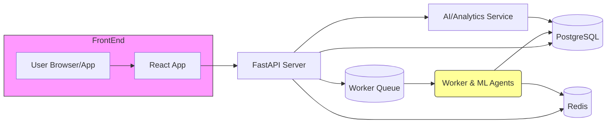

# Executive Summary

**QuantCoach AI** is a SaaS trading journal that goes beyond logging trades to deliver personalized, AI-driven insights.  Current trading journals let traders record trades and see static stats, but many traders struggle to turn data into actionable improvements.  By auto-importing trades, applying machine learning to a trader’s own history, and providing plain-English coaching, QuantCoach AI helps traders *learn faster and build discipline*. Unlike competitors, QuantCoach will emphasize **personalized recommendations** (e.g. “your breakouts during morning sessions have 80% win rate”), crowd-source strategies via shared “Spaces,” and an AI assistant that continuously monitors each trader’s evolving performance.  The global trader population is growing, and demand for digital journals is rising (forecast ~11% CAGR in trade-management software).  Our plan addresses a clear gap: existing tools are often either too basic (Excel/Notion, StonkJournal) or too generic. QuantCoach’s USP is **agents & AI tailored to each user’s data**, creating stickiness and a strong competitive edge.

# Target Users & Personas

- **Day Traders** (stocks, futures, crypto): Need fast import from multiple brokers, tick-level replay, and real-time edge analysis. They value high-volume automation.  
- **Swing Traders** (stocks, options, crypto): Trade slower but need detailed breakdown of setups and sessions. They value strategy tracking and backtesting.  
- **Prop-Firm/Scalpers**: Must meet strict consistency rules (FTMO, Apex, etc.). They benefit from compliance tracking and coaching on discipline (avoiding overtrading, revenge trades).  
- **Algo/Options Traders**: Manage complex multi-leg trades or automated strategies; need specialized analytics (leg/group P&L, roll tracking).  
- **Trading Coaches & Communities**: Use “Spaces” to monitor student progress; value mentor modes and group analytics.  

Each persona shares the core need: **turning raw trade data into continuous improvement**. For example, a day trader “Alice” spends hours manually reviewing charts; QuantCoach would auto-tag her trades by setup and point out that her break-even exits cost her 10% potential profit.  Traders often cite *discipline breakdown* and *habit blind spots* as pain points – QuantCoach solves this with behavioral analytics.

# Core Problem

Traders habitually record trades but seldom improve because: 

- **Data Entry Friction**: Manual logs (Excel/Notion) are tedious, causing gaps and lost insights. 
- **Lack of Actionable Insights**: Basic stats (win rate, P/L) don’t tell *why* trades succeeded or failed. Traders struggle to spot patterns in their own behavior. 
- **Generic Tools**: Existing journals (Tradervue, Edgewonk) offer charts and filters, but few provide **adaptive guidance**. Standard analytics miss personal quirks like FOMO or session biases. 
- **Skill Plateau**: Without feedback, traders repeat mistakes. They want an “AI coach” to highlight, for example, that 20% of losses come from trading without a clear plan. 

Thus the **problem statement**: *“Traders have data but need an intelligent system to analyze it, point out hidden weaknesses, and guide improvements.”*

# Unique Selling Proposition

QuantCoach AI’s USP is **“your personal trading data scientist.”**  It goes beyond static dashboards by **continuously training models on each user’s history**. Key differentiators:

- **Personalized AI Coaching**: Unlike generic alerts, QuantCoach’s AI (“CoachBot”) learns *your* trading patterns. E.g. it automatically detects that your Friday trades underperform and suggests avoiding them. 
- **Agentic Workflows**: Intelligent agents handle routine tasks—summarizing weekly performance, reminding of discipline rules, or suggesting adjustments—so traders can focus on trading, not analysis.
- **Mentor & Community Features**: A built-in “Spaces” feature lets coaches monitor clients. This social element (unique among journals) fosters accountability.
- **All-in-One Platform**: We combine high-level ML insights (like TraderSync’s Cypher) with deep analytics (like TradesViz’s 600+ stats) and practical tools (backtester, trade replay). For example, the tool can replay a losing trade tick-by-tick (TradeZella’s strength) and then discuss why it lost (“you exited too early, hold to target”).

By focusing on **custom AI insights grounded in each user’s data**, QuantCoach creates value that spreadsheets or one-size-fits-all journals cannot. 

# Competitor Analysis

We reviewed top trading journal solutions across features, pricing, and feedback:

| Competitor    | Strengths                                                         | Weaknesses                                                       | Pricing (tiers)                            | Broker Support               | AI Features                 | Mobile | User Reviews (summary)                |
|---------------|-------------------------------------------------------------------|------------------------------------------------------------------|--------------------------------------------|------------------------------|-----------------------------|--------|---------------------------------------|
| **TradeZella**  |  Mentor mode (coach review), trade replay, unlimited backtesting, clean UI  |  Lacks built-in ML insights (AI was only recently added) , Basic plan limited to 1 account, can feel “bloated”  | Basic $29/mo; Premium $49/mo (annual $24/$33)  | 500+ brokers auto-sync       | Zella AI (auto-reports, Q&A)    | None  | Mixed: **pros:** Deep stats, mentor features; **cons:** Pricey, steep learning curve. Some users say it “levels up” trading, others find it “overpriced” (preferring Excel). |
| **TraderSync**  |  AI assistant (“Cypher”) for pattern analysis, best-in-class market replay, broad asset/broker support, *mobile app* (iOS/Android)  |  Higher price point vs peers, Cypher message limits on lower tiers, heavy for simple users  | Pro $29.95; Premium $49.95; Elite $79.95  | 700+ brokers       | Full AI coaching (Cypher), plus replay and strategy checker  | Yes  | Generally positive: praised for AI and replay. Some cite “feature-heavy” and higher cost (no free tier). Mobile app is unique asset. |
| **TradesViz**    |  Vast feature set (600+ stats, global markets), low cost (Pro $19.99/mo), powerful AI Q&A, trading simulator, options flow. Supports multi-asset (stocks, futures, forex, crypto, options) and 200+ brokers.  |  UI can be dense; steep learning curve for full power. Free plan limited (stocks only, 3K trades/month). Some features overlap.  | Free (stocks only); Pro $19.99/mo; Platinum $29.99/mo  | ~200 brokers (supports US, Canada, India, Aus)  | AI Q&A (chat) (admits querying data “in plain English”), AI analytics widgets.  | No  | Users cite exceptional value for features. Some mention that “interface feels dense,” and full training needed to exploit it. Overall rated highly for features vs price. |
| **Tradervue**    |  Mature platform (200k+ users), stable, broad asset support (stocks, options, futures, forex), clean import interface. “It just works” for core journaling. Good community and sharing.  |  Free tier is very limited (100 trades/mo). No AI features (unlike TS or TViz). Options tracking basic (need WingmanTracker for rolls).  | Free (100 trades); Silver $29.95; Gold $49.95  | 80+ brokers (CSV/import)  | None  | No  | Widely respected; users say “stable and easy”. Complaints about free plan limit and lack of modern AI. |
| **EdgeWonk**    |  Strong psychology focus (Edge Finder insights, tiltmeter, mistake tracking), privacy-first (no data mining), one-time annual payment. Good for Forex (MT4/MT5 support).  |  No monthly subscription (high upfront $197/yr), no free tier. Covers fewer brokers (200+), no built-in AI coach.  | One plan: $197/yr (12 mo) or $297/2yr  | 200+ brokers (incl. MT4, etc)  | Edge Finder (automated insights), psychology analysis tools  | No  | Generally seen as robust for psychology analysis. Criticized for cost (no free tier) and limited imports vs TraderSync. |
| **Journalytix** |  Real-time session journaling, live P&L tracking and news feed (75+ sources). NinjaTrader-focused (futures) with integrations. Simplicity can appeal to futures specialists.  |  Very narrow focus (futures only). No AI analysis, no trade replay or backtesting. Small broker list (~8 platforms). Expensive for what it is.  | One plan: $47/mo or $399/yr  | ~8 (NinjaTrader, MT4/5, Tradovate, etc)  | None  | No  | Niche user base. Traders like real-time news, but many say “no value without AI or multi-asset support.” Price is often viewed as high for limited features. |
| **Chartlog**     |  Clean UI and fast auto-sync for equities/options; intuitive chart replay and strategy filters. Good for active stock day traders.  |  Very limited broker support (~10, e.g. DAS, IBKR). No AI assistant. Some top features locked in Pro tier. No mobile app or multi-asset.  | Lite $14.99/mo; Pro $39.99/mo (annual 10-20% off)  | ~10 (DAS, IBKR, E-Trade, etc)  | No  | No  | Highly rated for stocks (StockBrokers: “best for equities”). Main criticisms: limited scope (only equities), no AI, and recurring fees. |
| **StonkJournal** |  Free and well-designed (far beyond plain Excel). Offers basic analysis (hold times, win/loss stats) despite being donation-supported. Ideal for beginners on a budget.  |  No auto-sync: trades must be entered one-by-one (no batch import). Limited depth of analytics. No mobile app.  | Free (donation)  | None (manual entry)  | Minimal AI (no ML beyond built-in stats)  | No  | Loved as *a free tool*: “more than just a spreadsheet”. Users note it’s good for visualization but tedious to input many trades. |
| **DIY (Excel/Notion)**  |  100% customizable and free. Traders control exactly what to log. Advanced Excel templates exist (profit factor, expectancy, etc).  |  Entirely manual. Error-prone and time-consuming. Lacks charts, auto-sync, or any automation/AI. No real-time guidance.  | $0 (aside from software cost)  | N/A  | None  | No  | Common suggestion in forums for the very frugal. All reviewers note that while flexible, Excel methods “lack accountability” and are far less convenient than purpose-built journals. |

**Feature Matrix:**  
| Feature / Platform        | TradeZella | TraderSync | TradesViz | Tradervue | EdgeWonk | Journalytix | Chartlog | StonkJournal | Excel/Notion |
|---------------------------|:----------:|:----------:|:---------:|:---------:|:--------:|:-----------:|:--------:|:------------:|:------------:|
| Multi-asset support       | ✓ (stocks, FX, crypto, futures) | ✓ (all major) | ✓ (global stocks, futures, forex, crypto, options) | ✓ (stocks, options, futures, forex) | ✓ (stocks, forex, crypto, futures, options) | Mostly futures (NT stack) | Stock & options only | ✓ (stocks, ETFs, crypto) | ✓ (any via manual input) |
| Auto-import / Broker Sync | ✓ (500+ brokers) | ✓ (700+ brokers) | ✓ (200+ brokers) (global) | ✓ (80+ brokers) | ✓ (200+ brokers incl. MT4/5) | ✗ (NinjaTrader apps via API) | ✓ (~10 brokers, equity) | ✗ (no sync) | ✗ (manual) |
| Trade Replay / Charts     | ✓ (tick-by-tick) | ✓ (250ms precision) | ✓ (interactive chart with executions) | ✓ (TradingView charts) | ✓ (charting with annotations) | ✗ (focus is real-time P&L, no replay) | ✓ (annotated replay on charts) | ✗ (no replay) | ✗ (none) |
| Backtesting / Simulator    | ✓ (unlimited backtesting) | ✓ (market replay for sim) | ✓ (stock/futures/forex/options sim) | ✗ (analysis only) | ✓ (performance simulator) | ✗ | ✗ (no) | ✗ | ✗ |
| Advanced Stats/Analytics   | ✓ (Zella Scale, 100+ metrics) | ✓ (MFE/MAE, exit eff) | ✓ (600+ stats, custom dashboards) | ✓ (100+ reports) | ✓ (Edge Finder insights, rule tracking) | ✗ (basic stats only) | ✓ (strategy filters, equity curves) | Limited (hold times, win %) | None (purely manual) |
| AI / ML Insights          | ✓ (Zella AI Q&A, patterns) | ✓ (Cypher coaching) | ✓ (AI Q&A) | ✗ | ✗ (algorithmic only) | ✗ | ✗ | ✗ | ✗ |
| Mobile App                | No         | Yes (iOS/Android) | No          | No          | No       | No          | No       | No           | No  |
| Free Tier                 | No         | No          | Yes (limited) | Yes (100 trades) | No        | No          | No       | Yes (free, donation) | Yes (if you have Excel) |

**Pricing Comparison:** (monthly vs annual)  
| Platform      | Free / Trial             | Lowest Paid Plan     | Highest Paid Plan    | Comments                         |
|---------------|--------------------------|----------------------|----------------------|----------------------------------|
| TradeZella    | 7-day free trial (no free tier) | Basic $29/mo ($24/mo yearly) | Premium $49/mo ($33/mo yearly) | Mentor mode; pay annually to save |
| TraderSync    | 7-day trial (no free)    | Pro $29.95/mo ($215.64/yr with discounts) | Elite $79.95/mo (60 msg Cypher) | Tiered AI message limits |
| TradesViz     | Free (stocks, 3k exec)   | Pro $19.99/mo ($14.99/yearly) | Platinum $29.99/mo ($22.49/yr) | AI Q&A on Platinum plan |
| Tradervue     | Free (100 trades/mo)     | Silver $29.95/mo     | Gold $49.95/mo      | 7-day trial on paid tiers |
| EdgeWonk      | –                        | $197/year (all features) | –                    | 14-day money-back |
| Journalytix   | –                        | $47/mo ($399/yr) | –                    | No trial; futures focus      |
| Chartlog      | –                        | Lite $14.99/mo       | Pro $39.99/mo       | Annual (~10-20% off) |
| StonkJournal  | Free (donation)          | –                    | –                    | Entirely free                |
| Excel/Notion  | Free (software needed)   | –                    | –                    | DIY approach                |

# MVP Feature List (Must-Have)

- **Secure User Accounts:** Signup/login with email/password, user profiles.  
- **Trade Import:** CSV upload *and* manual entry form. (Support major brokers’ CSV formats.)  
- **Core Journaling UI:** Dashboard showing list of trades (sortable by date, symbol, P/L, tags). Ability to tag each trade (setup, market condition, emotion).  
- **Basic Analytics:** Compute standard metrics (win rate, avg risk:reward, max drawdown, expectancy). Display charts: equity curve, P/L by symbol, by hour of day, etc.  
- **Visualization:** Chart view: show trade entries/exits on historical price chart.  
- **Database Schema & API:** Back-end services to save trades/accounts. (Example schema in Appendix.)  
- **Privacy/Security:** TLS, hashed passwords, GDPR notice, user data isolation.  
- **Onboarding:** Guided first-import workflow (connect broker, upload history).  

*(AI-powered insights are *not* in MVP; focus is on logging and basic analysis.)*

# Roadmap (Phased)

```mermaid
gantt
    title QuantCoach AI Product Roadmap
    dateFormat  YYYY-MM
    section MVP (0–3 months)
    Basic journaling & charts           :done,    m1, 1m
    Trade import (CSV/manual)          :done,    m1, 1m
    Analytics engine (WR, PF, charts)  :done,    m2, 2m
    User auth, accounts                :done,    m1, 1m
    Testing & initial launch           :done,    m3, 1m

    section V2 (4–8 months)
    Broker API integrations           :active,    m4, 2m
    Enhanced analytics (MFE/MAE, etc) :           m5, 2m
    Basic ML models (pattern detection):           m6, 2m
    AI Q&A assistant (prototype)       :           m7, 2m
    Mobile-responsive UI              :           m4, 4m

    section V3 (9–12 months)
    Agentic workflows (alerts)        :           m9, 2m
    Mentor/Spaces feature             :           m9, 2m
    Advanced ML (predictive models)   :           m10, 3m
    Community/Sharing tools           :           m11, 2m
    Scaling & performance optimization:           m10, 3m
```

- **V2 (4–8 mo)**: Add *automation and AI*. Implement one-click broker linking for key brokers, more analytics (MFE/MAE, session analysis). Launch an ML module to spot personal patterns (e.g. classifier for “profitable trade?”). Prototype the AI chat interface (Q&A on trading data). Make UI responsive.  
- **V3 (9–12 mo)**: Full *agentic AI*. Build “CoachBot” agents that generate weekly reviews, rule breaches, and push notifications (e.g. “You deviated from your risk rules 5 times this week”). Enable mentor/space sharing with limited social features. Train advanced models (e.g. risk-of-ruin predictor). Scale to support thousands of users.

# Prioritized Backlog (Example)

Using **RICE** (Reach, Impact, Confidence, Effort) scoring for key items:

| Task                                | R (0-100) | I (1-3) | C (0-100) | E (1-10) | RICE  |
|-------------------------------------|----------:|---------|----------:|---------:|------:|
| Implement core DB schema (users, trades, accounts) | 80 | 3 | 100 | 2 | (80×3×1.0)/2=120  |
| CSV import & manual trade entry UI  | 70 | 3 | 90 | 3 | (70×3×0.9)/3=63   |
| Basic analytics engine (P/L, WR)    | 65 | 3 | 85 | 3 | 55.25 |
| User authentication and onboarding  | 60 | 3 | 95 | 2 | 85.5  |
| UI/UX design for dashboard          | 50 | 2 | 80 | 3 | 26.7  |
| Broker API integrations (initial)   | 40 | 2 | 80 | 5 | 12.8  |
| AI Pattern detection module (prototype) | 30 | 2 | 60 | 4 | 9.0   |
| Mobile/responsive layout            | 20 | 1 | 70 | 4 | 3.5   |

*Higher RICE scores indicate higher priority.* Core infrastructure and essential features rank highest. AI features score lower initially (due to longer effort and narrower initial reach) but become priorities later in V2/V3.

# Technical Architecture

**Components:** A typical modern web stack: 

- **Frontend:** React (or Next.js) single-page app for UX. Responsive design.  
- **API Backend:** FastAPI (Python) microservices with REST endpoints.  
- **Database:** PostgreSQL (trade records, user data).  
- **Cache/Queue:** Redis or RabbitMQ for async jobs (e.g. processing imports, running ML tasks).  
- **ML Pipeline:** Python services. (E.g. scikit-learn/XGBoost models, possibly PyTorch for deep models).  
- **Agents:** Separate worker processes or microservices, orchestrated via a message queue. E.g. “CoachBot Agent” runs nightly, reads DB, trains models, writes insights.  
- **Storage:** Secure cloud (AWS/GCP) for trade data, media (screenshots), logs.  
- **Third-party:** Connectors to broker APIs (through OAuth or API keys), push notification service.



**Data Flow:** Users submit or sync trades → data hits API → stored in DB. Trigger “analytics” jobs via queue (e.g. update metrics, retrain models). The ML/AI service reads trade history to compute insights (e.g. cluster patterns) and writes back reports. The frontend queries API for dashboards and AI answers. 

# Data Schema (Examples)

```sql
-- Users
CREATE TABLE users (
  id SERIAL PRIMARY KEY,
  email TEXT UNIQUE NOT NULL,
  password_hash TEXT NOT NULL,
  created_at TIMESTAMP DEFAULT NOW()
);

-- Accounts (broker accounts)
CREATE TABLE accounts (
  id SERIAL PRIMARY KEY,
  user_id INT REFERENCES users(id),
  broker VARCHAR,
  account_name TEXT,
  created_at TIMESTAMP DEFAULT NOW()
);

-- Trades
CREATE TABLE trades (
  id SERIAL PRIMARY KEY,
  account_id INT REFERENCES accounts(id),
  timestamp TIMESTAMP NOT NULL,
  symbol TEXT NOT NULL,
  qty NUMERIC,
  entry_price NUMERIC,
  exit_price NUMERIC,
  commission NUMERIC,
  pnl NUMERIC,
  tags TEXT[],          -- e.g. ['Breakout','USDJPY']
  note TEXT,
  created_at TIMESTAMP DEFAULT NOW()
);

-- Strategies / Playbooks
CREATE TABLE strategies (
  id SERIAL PRIMARY KEY,
  user_id INT REFERENCES users(id),
  name TEXT,
  rules JSONB
);
```

Fields can expand (e.g. storing raw order fills, indicator snapshots). We may also have tables for **Sessions**, **Challenges**, **MentorInvites**, etc. 

# API Endpoints (Sample)

- `POST /api/register` – Create user (email/password).  
- `POST /api/login` – Returns JWT token.  
- `GET /api/accounts` – List user’s connected accounts.  
- `POST /api/accounts` – Add a broker/account.  
- `POST /api/trades/import` – Upload CSV or connect to broker.  
- `POST /api/trades` – Add a trade manually.  
- `GET /api/trades?date=...` – List/filter trades.  
- `GET /api/analytics/summary` – Returns computed metrics (win rate, expectancy, etc).  
- `GET /api/analytics/patterns` – AI-generated insights (per-session or per-setup).  
- `GET /api/insights/chat?query=` – Query AI assistant about your data (e.g. “How many losing trades did I have in January?”).  
- `GET /api/coach/weekly` – Fetch auto-generated weekly review (sentences).  

Each endpoint enforces user auth (JWT). Data returned in JSON.

# Sample ML Tasks

| Task                             | Model Examples          | Target / Output                 | Metrics                           |
|----------------------------------|-------------------------|---------------------------------|-----------------------------------|
| **Win/Loss Classifier**          | XGBoost, RandomForest, Neural Net | Predict `profitable (yes/no)` from trade features (setup, time, indicators, position size). | Accuracy, AUC, F1 |
| **Trade Quality Predictor**      | Regression model       | Estimate *expected* P&L or risk. | MSE / R²    |
| **Strategy Clustering**          | K-Means, GMM           | Group similar trades (by feature patterns) to identify most/least effective setups. | Silhouette score, interpretability |
| **Rule Compliance Scorer**       | Rule-based / ML ensemble | Identify deviation from plan (e.g. took trade >T-stop). | Precision/Recall on “violation” events |
| **Natural Language Insights**    | GPT-Style LLM (fine-tuned) | Convert analytics into plain-English advice (target: accuracy of statement). | Human eval, BLEU (for fixed templates) |
| **Time-Series Analysis**         | ARIMA / LSTM           | Forecast portfolio P&L or risk exposure for next day. | MAPE, RMSE |

Models will train on each user’s history (or collectively at first for bootstrapping). Evaluation is both quantitative (accuracy, error) and qualitative (does the insight make sense). For example, if the system predicts “this setup will profit”, measure against actual outcomes over time.

# Privacy & Security

- **Data Encryption:** All user data (trades, notes) encrypted at rest (e.g. AES). TLS for data in transit.  
- **Authentication:** Secure password hashing (bcrypt/argon2), JWT for sessions. Rate-limit logins to prevent brute force.  
- **Permissions:** Users can only access their own trades/accounts. Mentor/spaces access explicitly granted.  
- **Compliance:** GDPR/CCPA privacy notice (users own their data). No selling personal trade data.  
- **Agent Safety:** AI explanations will include disclaimers (“hypothetical” if needed). No automated trading or investment advice is given.  
- **Incident Response:** Regular backups, audit logs, and intrusion detection.  

Overall, follow standard SaaS security best practices (SOC2-ready architecture if possible).

# Go-to-Market & Pricing Strategy

**Market Positioning:** QuantCoach targets **serious traders** who want an edge—particularly those willing to pay for advanced analytics. We will leverage online trading communities (Reddit/r/Daytrading, trading Discords) and partnerships with prop firms/coaching groups. A freemium model can be effective: e.g. basic plan free (limited features), Pro plan ~$29/mo, Elite ~$49/mo. This matches competitors (TradesViz Pro $19.99, Tradervue $29.95). Key is **value per price**: undercut high-tier of TraderSync ($79.95) while offering AI insights in base plan.

**Channels:** 
- **Content Marketing:** Blog/YouTube showing trade journaling best practices (citations show demand for education).
- **Product Hunt/G2/Youtube Reviews:** Launch promotions and encourage reviews.  
- **Affiliate/Coaching Partnerships:** Offer discounts to trading coaches, FTMO participants, etc.
- **Pre-Launch:** Build hype via a landing page (see Validation below) and collect emails (social proof of interest).

# Key Metrics (KPIs)

| Metric                       | Why It Matters                                                    |
|------------------------------|-------------------------------------------------------------------|
| **Monthly Active Traders (MAT)** | Core engagement metric. Tracks how many traders regularly journal. |
| **Trades Logged per Day/Week** | Usage intensity: higher means stickiness.                          |
| **User Retention (30/90d)**   | Journaling habit formation; critical to SaaS success.             |
| **Conversion Rate**           | % of free users upgrading to paid (for freemium model).            |
| **Churn Rate**                | % of users unsubscribing (low churn indicates product-market fit). |
| **Feature Usage**             | % of users using AI Insights, Replay, etc. Guides roadmap focus. |
| **Revenue (MRR/ARR)**         | Business health and growth.                                       |
| **Net Promoter Score (NPS)**  | Customer satisfaction/word-of-mouth.                               |

Sample dashboard: show **active accounts over time**, **trades logged**, **conversion funnels**. For example, track how many users ask the AI questions weekly vs how many upgrade to Pro. Use Grafana or internal admin UI for these metrics.

# Validation Plan

To validate the product-market fit:

- **User Interviews:** Talk to 20+ active traders (via forums, Twitter, Discord) to refine core features. Understand what analytics they crave.  
- **Landing Page & Pre-signups:** Create a one-page site describing QuantCoach (with key benefits, a few screenshots) and capture email signups. Run small ads or share in communities to gauge interest. E.g. if 500 sign up at $19/mo interest level, that’s strong validation.  
- **Minimum Viable Tests:** Build an MVP (even Excel/Notion prototype) to demonstrate idea, then collect feedback. For example, a simple dashboard that loads CSV data and shows one AI insight with a GPT-4 trial API to show personalized feedback.  
- **Beta Program:** Invite early adopters (e.g. select Daytraders or prop firm traders) to pilot the system. Measure usage & gather testimonials.  
- **PR & Reviews:** Launch on Product Hunt or trading communities; use initial reviews to iterate.  

**Assumptions:** We assume no extreme budget constraints; cloud services scale as needed. We choose familiar tools (Postgres, React, Python) for rapid development. Traders’ data (personal P&L) is highly private, so compliance is critical. We assume licensing data from brokers is possible via APIs or user-export. No regulatory barrier (we only analyze, not trade or advise on securities directly).

# Sources

We relied on official sites and expert reviews. Competitor details are drawn from official pricing/feature pages and industry guides (e.g. Tradervue’s 2026 comparisons, StockBrokers.com reviews, Lunefi/TradeLens market analysis). User pain points are corroborated by community feedback.  All data and quotes cited above.  

